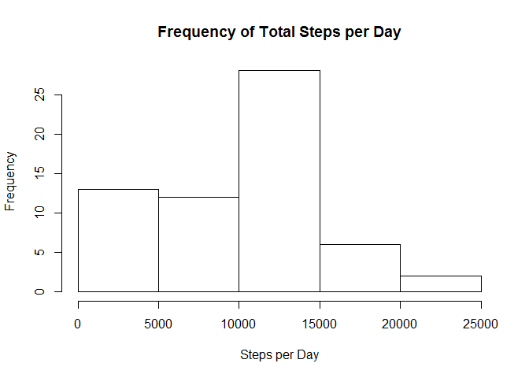
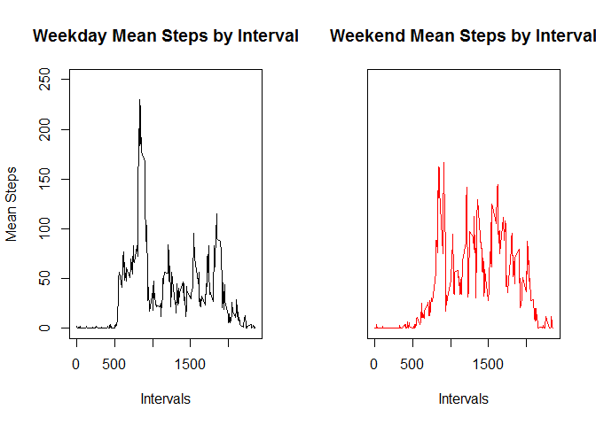

# Step Data
Jeff Jackson  
February 15, 2017  

###The data was loaded into R.


```r
library(dplyr)
```

```
## 
## Attaching package: 'dplyr'
```

```
## The following objects are masked from 'package:stats':
## 
##     filter, lag
```

```
## The following objects are masked from 'package:base':
## 
##     intersect, setdiff, setequal, union
```

```r
library(knitr)
file <- "C:/Users/Jeff/Research/activity.csv"
raw.data <- read.csv(file)
```


###Data was reorganized to put intervals as observations and dates as columns.


```r
dates <- unique(raw.data[,2])
intervals <- unique(raw.data[,3])
all.data <- data.frame()

for (i in intervals){
        int.data<- filter(raw.data,interval == i)
        steps.data <- int.data[,1]
        all.data <- rbind(all.data, steps.data)
}
```


###The total number of steps taken every day by frequency and the summary of total steps was analyzed.


```r
total.steps <- as.numeric(colSums(all.data, na.rm = TRUE))
hist(total.steps, main = "Frequency of Total Steps per Day", xlab = "Steps per Day")
```

<!-- -->

```r
summary(total.steps)
```

```
##    Min. 1st Qu.  Median    Mean 3rd Qu.    Max. 
##       0    6778   10400    9354   12810   21190
```


###The mean number of steps taken at every interval was plotted which illustrated a peak mean of 206.1698 at interval 835.


```r
int.steps <- as.numeric(rowMeans(all.data, na.rm = TRUE))
plot(x = intervals, y=int.steps, xlab = "Intervals", ylab = "Mean Steps", main = "Mean Steps by Interval", pch = 20, cex = 0.5)
```

<!-- -->

```r
tsteps <- cbind(intervals, int.steps)
print(tsteps[which.max(tsteps[,2]),])
```

```
## intervals int.steps 
##  835.0000  206.1698
```


###The total number of NA values in the data was calculated.


```r
sum(is.na(raw.data))
```

```
## [1] 2304
```


###As this is a large number of missing data points, the data was then modified to replace NA values with the mean value of all available data for the respective interval containing the NA.


```r
all.data2 <- all.data
ind <- which(is.na(all.data2), arr.ind=TRUE)
all.data2[ind] <- rowMeans(all.data2,  na.rm = TRUE)[ind[,1]]
```


###The modified data was again analyzed looking at frequencies of total steps by day. Which illustrated a shift toward a more normal distribution. Additionally as noted in the summary table, the mean and median increased slightly as well.


```r
total.steps2 <- as.numeric(colSums(all.data2))
hist(total.steps2, main = "Frequency of Total Steps per Day", xlab = "Steps per Day")
```

<!-- -->

```r
summary(total.steps2)
```

```
##    Min. 1st Qu.  Median    Mean 3rd Qu.    Max. 
##      41    9819   10770   10770   12810   21190
```


###Finally a comparison between weekday (Monday - Friday) and weekend (Saturday & Sunday) activity was plotted.  This illustrates a slight reduction in activity on weekends, with similar patterns of activity with respect to time.


```r
library(lubridate)
```

```
## 
## Attaching package: 'lubridate'
```

```
## The following object is masked from 'package:base':
## 
##     date
```

```r
dates2 <- as.Date(dates, format = '%Y-%m-%d')
dates3 <- weekdays(dates2)
wkends <- grep("Saturday|Sunday", dates3)
wkdays <- grep("Monday|Tuesday|Wednesday|Thursday|Friday", dates3)
wkday.data <- all.data2[ ,wkdays]
wkend.data <- all.data2[ ,wkends]
wkday.steps <- as.numeric(rowMeans(wkday.data))
wkend.steps <- as.numeric(rowMeans(wkend.data))
par(mfrow=c(1,2))
plot(x = intervals, y=wkday.steps, xlab = "Intervals", ylab = "Mean Steps", main = "Weekday Mean Steps by Interval", ylim = c(0,250), pch = 20, cex = 0.5)
plot(x = intervals, y=wkend.steps, xlab = "Intervals", ylab = "", yaxt="n", main = "Weekend Mean Steps by Interval", ylim = c(0,250), col = "red", pch = 20, cex = 0.5)
```

<!-- -->

